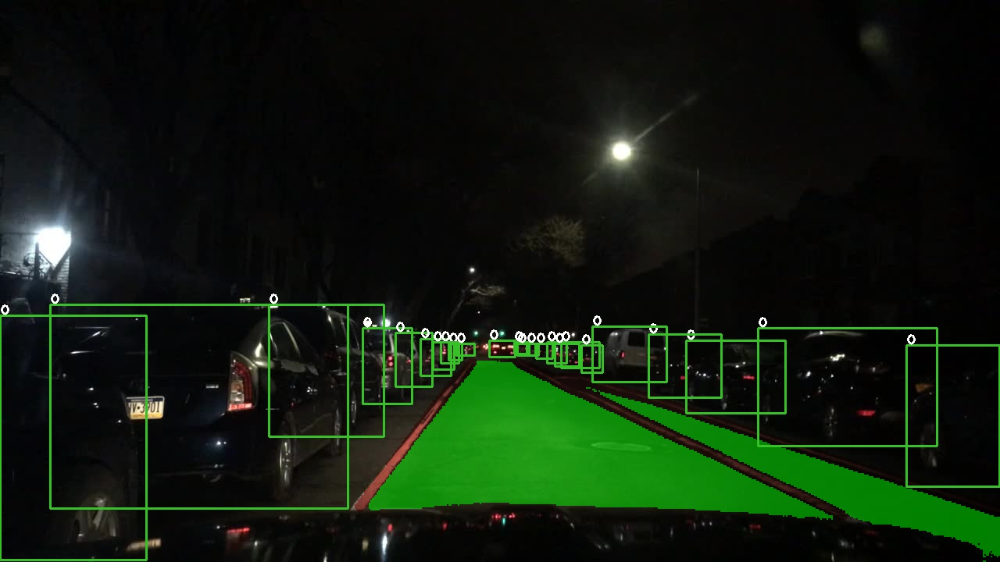

YoloP TensorRT Usage(简要说明)
=====

Fork from [hustvl/YOLOP](https://github.com/hustvl/YOLOP), modify from [ausk/YOLOP](https://github.com/ausk/YOLOP/), push into [wang-xinyu/tensorrtx](https://github.com/wang-xinyu/tensorrtxls)


## 1. 准备构建环境 | Prepare building environments

Make sure you have install `c++`(support c++11)、 `cmake`、`opencv`(4.x)、`cuda`(10.x)、`nvinfer`(7.x).


## 2. 编译 | build

~~Go to `YOLOP/toolkits/deploy`~~.

Go to `yolop`.


```
mkdir build
cd build

cmake ..
make
```

Now you can get `yolov5` and `libmyplugins.so`.


## 3. 生成和测试 trt | Generate and test trt

~~Go to build dir (`YOLOP/toolkits/deploy/build`)~~.

Go to `yolop/build`.

### 3.1 gen wts
Download [YOLOP](https://github.com/hustvl/YOLOP)

Edit `gen_wts.py`, change `BASE_DIR` to realpath of `YOLOP`.

```
python3 ../gen_wts.py
```

### 3.2 gen trt
```
./yolov5 -s yolop.wts  yolop.trt s
```

### 3.3 test trt
```
mkdir ../results
./yolov5 -d yolop.trt  ../images/
```

It will output like as follow if successful! (`Jetson Xavier NX - Jetpack 4.4`)
```
1601ms
26ms
26ms
26ms
26ms
28ms
```

You can check results dir.




