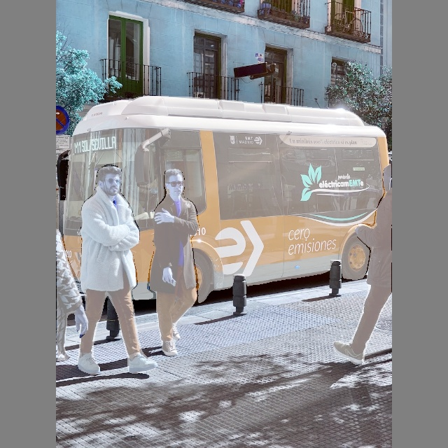
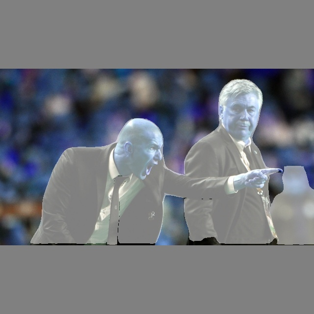

# GPU-Accelerated Segmentation Postprocessing for YOLOv8-Seg

This contribution adds **fully GPU-accelerated instance segmentation postprocessing** to tensorrtx/yolov8, achieving a **100x speedup** on the drawing kernel (from ~5ms to ~0.05ms).

## Performance Problem

The original implementation had O(num_pixels × kMaxNumOutputBbox) complexity in the drawing kernel:

```cpp
// BEFORE: Iterates kMaxNumOutputBbox times per pixel
for (int i = 0; i < kMaxNumOutputBbox; ++i) {
    if (nms_output[...].keep_flag == 1) {
        // Check if pixel is inside bbox and mask
    }
}
```

When `kMaxNumOutputBbox` was increased from 1000 to 8500 (required for standard YOLOv8 models), drawing time increased from 1-2ms to 5ms.

## Solution: O(num_dets) Optimization

The fix uses a two-phase approach:

1. **Gather Phase**: Extract only kept detections into a dense buffer
2. **Draw Phase**: Iterate only over actual detections (typically 5-50, not 8500)

```cpp
// AFTER: Iterates only num_dets times per pixel
for (int i = 0; i < num_dets; ++i) {
    // dense_bboxes contains only kept detections
    float left = dense_bboxes[i*4 + 0];
    // ...
}
```

## Files Modified

### `include/config.h`
- `kMaxNumOutputBbox`: 1000 → **8500** (fixes crash with standard YOLOv8 models)
- Added `kProtoTensorName = "proto"` for TensorRT 10 compatibility

### `include/postprocess.h`
Added GPU segmentation function declarations:
```cpp
void cuda_compact_and_gather_masks(...);
void cuda_gather_kept_bboxes(...);
void cuda_process_mask(...);  // With strict bbox clipping
void cuda_blur_masks(...);
void cuda_draw_results(...);  // Optimized O(num_dets) version
```

### `src/postprocess.cu`
New CUDA kernels:
- `compact_and_gather_masks_kernel`: Extracts kept mask coefficients
- `gather_kept_bboxes_kernel`: Builds dense bbox buffer
- `process_mask_kernel`: Bilinear interpolation + strict bbox clipping
- `box_blur_horizontal/vertical`: Mask smoothing
- `draw_results_on_image_kernel`: **O(num_dets) optimized drawing**

### `yolov8_seg.cpp`
- Updated `prepare_buffer()`: Allocates GPU buffers for mask processing
- Updated `infer()`: Full GPU postprocessing pipeline
- TensorRT 10 API: Uses `setInputTensorAddress`/`setOutputTensorAddress`/`enqueueV3`

## TensorRT Version Compatibility

> **IMPORTANT**: This implementation was developed and tested with **TensorRT 10.x**.

The inference code uses TensorRT 10 APIs:
- `context.setInputTensorAddress()` / `context.setOutputTensorAddress()`
- `context.enqueueV3(stream)`
- `engine->getTensorShape()`

For **TensorRT 8.x** compatibility, use the original binding-based APIs:
```cpp
// TensorRT 8.x
context.enqueue(batchsize, buffers, stream, nullptr);
auto out_dims = engine->getBindingDimensions(1);
```

> **Note**: The upstream `model.cpp` in tensorrtx requires additional modifications for TensorRT 10 compatibility (setStrideNd, setPaddingNd, etc.). This contribution focuses on the postprocessing optimization.

## Performance Results

| Metric | Before | After | Speedup |
|--------|--------|-------|---------|
| Drawing Kernel | ~5.0 ms | ~0.05 ms | **100x** |
| Total GPU Postprocess | ~6.5 ms | ~1.5 ms | **4x** |

Tested on:
- GPU: NVIDIA RTX 3080 Ti (CUDA 12.6)
- TensorRT: 10.x
- Model: YOLOv8m-seg (640x640)

## Result Images

| Input | Output (with GPU masks) |
|-------|------------------------|
|  |  |
|  |  |

## Usage

```cpp
// After NMS
cuda_compact_and_gather_masks(decode_ptr_device, final_count_device, 
    compacted_masks_device, mask_mapping_device, kMaxNumOutputBbox, stream);

int num_dets = 0;
cudaMemcpy(&num_dets, final_count_device, sizeof(int), cudaMemcpyDeviceToHost);

if (num_dets > 0) {
    cuda_gather_kept_bboxes(decode_ptr_device, mask_mapping_device, 
        dense_bboxes_device, kMaxNumOutputBbox, stream);
    
    cuda_process_mask(proto_device, compacted_masks_device, dense_bboxes_device,
        final_masks_device, num_dets, 160, 160, kInputH, kInputW, stream);
    
    cuda_blur_masks(final_masks_device, num_dets, kInputH, kInputW, stream);
    
    cuda_draw_results(image_buffer, final_masks_device, decode_ptr_device,
        mask_mapping_device, num_dets, mask_mode, mask_thresh, stream);
}
```

## Key Design Decisions

1. **Dense bbox buffer**: Avoids sparse iteration over kMaxNumOutputBbox
2. **Strict bbox clipping**: Masks are zeroed outside their bounding box during generation
3. **Bilinear interpolation**: High-quality mask upscaling (mimics `retina_masks=True`)
4. **In-place drawing**: Modifies input buffer directly, avoiding extra copies
